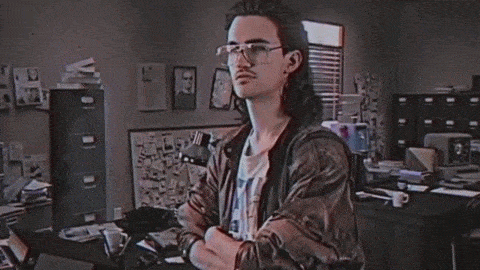

### Hi there, I'm Tom 👋

I'm a Cybersecurity student who dabbles in a bit of everything.

- 🔭 B.S. in Cybersecurity from West Virginia University.
- 📚 I’m currently learning Reverse Engineering | Binary Exploitation.
- 👯 Currently working at the Department of Commerce ESOC performing cyber analytics and incident response.
- 📫 How to reach me: [Email](thasselm@mix.wvu.edu)

*Template inspired by* [hazemessam](https://github.com/hazemessam)
